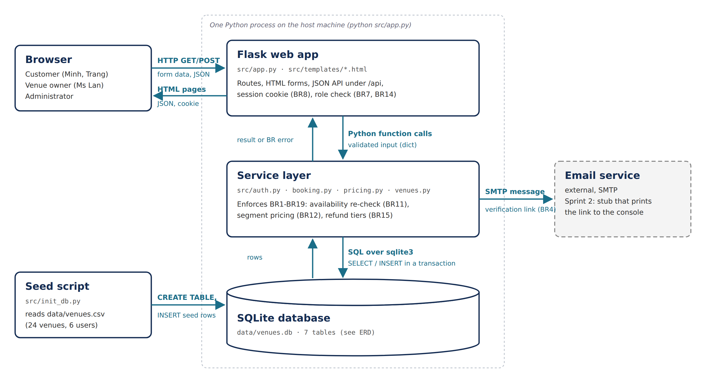
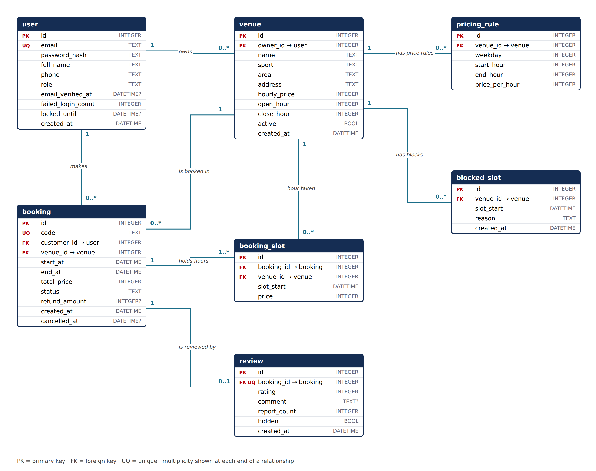
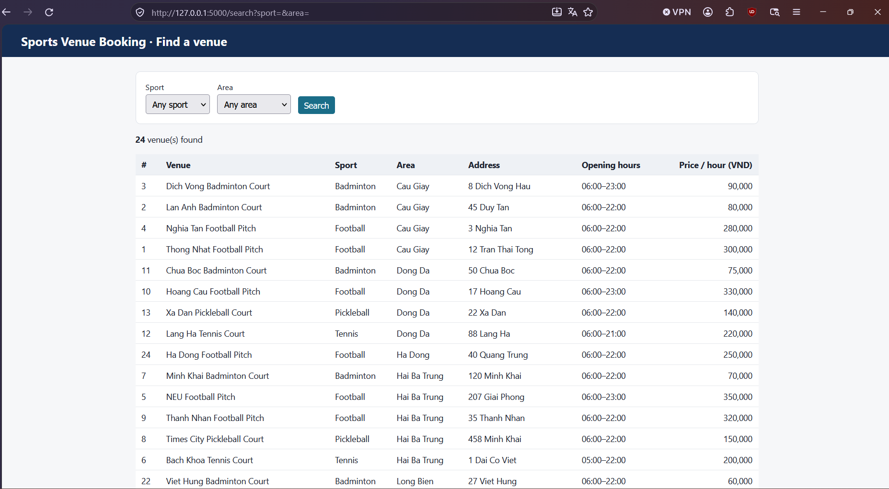

# Design - Sports Venue Booking System

**Milestone 2 · Team 09 · Sprint 2 (21/09/2026 - 04/10/2026)**

Milestone 1 ([`requirements.md`](requirements.md)) said what the product does. This
document says how it is built, and points at the walking skeleton that proves the layers
connect: a page, the Flask app, a real SQLite database, and back to the page.

To run it on a new machine, follow [`SETUP.md`](SETUP.md).

| Section                  | Owner          | Issue |
| ------------------------ | -------------- | ----- |
| 1. Architecture          | @htngochan2802 | #46   |
| 2. Data model            | @thunopro      | #44   |
| 3. API design            | @htngochan2802 | #47   |
| 4. Walking skeleton      | @peng543       | #45   |
| 5. Design decisions      | @htngochan2802 | #46   |
| 6. What changed since M1 | @thunopro      | #50   |

---

## 1. Architecture



The whole product runs as **one Python process** on one machine, with the database as a
file next to it. That is deliberate (see ADR 1 and ADR 3): the instructor must be able to
clone and run it in fifteen minutes on a machine we have never seen.

| Component       | Technology                                                                                | Where it runs           | Responsibility                                                                                                                                             |
| --------------- | ----------------------------------------------------------------------------------------- | ----------------------- | ---------------------------------------------------------------------------------------------------------------------------------------------------------- |
| Browser         | Any modern browser                                                                        | User's phone or laptop  | Renders HTML pages and submits forms. No business logic.                                                                                                   |
| Flask web app   | Python 3.11+, Flask 3, Jinja2 templates - `src/app.py`                                    | Host machine, port 5000 | Routes, form parsing, session cookie (BR8), role check before every owner/admin route (BR7, BR14), renders pages, serves the JSON API under `/api`.        |
| Service layer   | Plain Python modules - `src/auth.py`, `src/venues.py`, `src/booking.py`, `src/pricing.py` | Same process            | Every business rule BR1-BR19 lives here, not in routes and not in templates. Routes call it; it calls the database.                                        |
| SQLite database | SQLite 3 via the standard `sqlite3` module - `data/venues.db`                             | A file on the host      | Stores the 7 tables of section 2. `CHECK` and `UNIQUE` constraints are the last line of defence for BR1, BR3, BR11, BR13, BR18.                            |
| Seed script     | `src/init_db.py` + `data/venues.csv`                                                      | Run once by hand        | Creates every table and inserts 24 venues, 6 users, 5 bookings.                                                                                            |
| Email service   | SMTP (external)                                                                           | Outside our system      | Sends the verification link (BR4). **Sprint 2: a stub that prints the link to the console;** a real SMTP account is configured in Sprint 3 through `.env`. |

**What travels along each arrow**

| From → To                     | What travels                                                                                                       |
| ----------------------------- | ------------------------------------------------------------------------------------------------------------------ |
| Browser → Flask               | HTTP `GET` (page loads, search filters as query string) and `POST` (HTML form data, or JSON for `/api/*`)          |
| Flask → Browser               | Rendered HTML pages, JSON responses, the signed session cookie                                                     |
| Flask → Service layer         | Python function calls with already-parsed input, e.g. `create_booking(user_id, venue_id, date, start_hour, hours)` |
| Service layer → Flask         | A result object, or a `BusinessRuleError` carrying the BR number, message and HTTP code                            |
| Service layer → SQLite        | SQL statements over `sqlite3`; every write that checks and then inserts runs in one transaction                    |
| Seed script → SQLite          | `CREATE TABLE` from `src/schema.py`, then `INSERT` rows read from `data/venues.csv`                                |
| Service layer → Email service | An SMTP message containing the verification link (BR4)                                                             |

**Sprint 2 status.** Browser, Flask app, SQLite and seed script exist and are connected
(section 4). The service-layer modules are created one per story from Sprint 3; the only
query in the walking skeleton lives in `src/app.py` and moves to `src/venues.py` when
US03 is implemented.

---

## 2. Data model



Seven tables. Types are SQLite storage classes; `DATETIME` columns are stored as `TEXT`
in the form `YYYY-MM-DD HH:MM`, and money is always an `INTEGER` number of VND - never a
float, so 250,000 + 150,000 is exactly 400,000 (BR12). The DDL is
[`src/schema.py`](../src/schema.py).

| Table          | Purpose                                               | Columns (type)                                                                                                                                                                                                                                  | PK   | FK                                                   | Constraint · M1 rule it enforces                                                                                                                                                                                                                                                                           |
| -------------- | ----------------------------------------------------- | ----------------------------------------------------------------------------------------------------------------------------------------------------------------------------------------------------------------------------------------------- | ---- | ---------------------------------------------------- | ---------------------------------------------------------------------------------------------------------------------------------------------------------------------------------------------------------------------------------------------------------------------------------------------------------- |
| `user`         | Every account: customer, venue owner or administrator | `id` INTEGER · `email` TEXT · `password_hash` TEXT · `full_name` TEXT · `phone` TEXT · `role` TEXT · `email_verified_at` DATETIME NULL · `failed_login_count` INTEGER · `locked_until` DATETIME NULL · `created_at` DATETIME                    | `id` | -                                                    | `email` UNIQUE, case-insensitive · **BR1**. `phone` CHECK 10 digits starting with 0 · **BR3**. `email_verified_at` NULL = cannot book · **BR4**. `failed_login_count`, `locked_until` · **BR5**. `role` CHECK IN (customer, owner, admin) · **BR7**                                                        |
| `venue`        | A pitch or court that can be booked                   | `id` INTEGER · `owner_id` INTEGER · `name` TEXT · `sport` TEXT · `area` TEXT · `address` TEXT · `hourly_price` INTEGER · `open_hour` INTEGER · `close_hour` INTEGER · `active` BOOL · `created_at` DATETIME                                     | `id` | `owner_id` → `user.id`                               | `name` CHECK 3-100 characters, `hourly_price` CHECK 1,000-100,000,000 · **BR13**. `sport` CHECK IN a fixed list so search can match exactly · **BR9**. `owner_id` is what "owners act only on their own venues" is checked against · **BR14**                                                              |
| `pricing_rule` | A peak-hour price for one venue on one weekday        | `id` INTEGER · `venue_id` INTEGER · `weekday` INTEGER · `start_hour` INTEGER · `end_hour` INTEGER · `price_per_hour` INTEGER                                                                                                                    | `id` | `venue_id` → `venue.id`                              | CHECK `start_hour < end_hour`, half-open `[start, end)` · **BR12**. "Rules must not overlap" is checked in `src/pricing.py` - SQLite has no range-exclusion constraint · **BR12**                                                                                                                          |
| `blocked_slot` | One hour an owner has closed for maintenance          | `id` INTEGER · `venue_id` INTEGER · `slot_start` DATETIME · `reason` TEXT · `created_at` DATETIME                                                                                                                                               | `id` | `venue_id` → `venue.id`                              | UNIQUE (`venue_id`, `slot_start`); a blocked hour is excluded from search and booking · **BR16**. Blocking an hour that has a `booking_slot` row is refused in `src/booking.py` · **BR17**                                                                                                                 |
| `booking`      | One reservation by one customer                       | `id` INTEGER · `code` TEXT · `customer_id` INTEGER · `venue_id` INTEGER · `start_at` DATETIME · `end_at` DATETIME · `total_price` INTEGER · `status` TEXT · `refund_amount` INTEGER NULL · `created_at` DATETIME · `cancelled_at` DATETIME NULL | `id` | `customer_id` → `user.id`, `venue_id` → `venue.id`   | `code` UNIQUE (e.g. `BK-000148`). `total_price` is written once at confirmation and never recalculated · **BR12**. `refund_amount` records the 100% / 50% tier · **BR15**. `customer_id` is checked on every read · **BR14**                                                                               |
| `booking_slot` | One booked hour of one booking                        | `id` INTEGER · `booking_id` INTEGER · `venue_id` INTEGER · `slot_start` DATETIME · `price` INTEGER                                                                                                                                              | `id` | `booking_id` → `booking.id`, `venue_id` → `venue.id` | **UNIQUE (`venue_id`, `slot_start`)** - the database itself refuses a second booking of the same hour · **BR11** (see ADR 2). `price` keeps the per-segment price, so a 19:00-21:00 booking stores 250,000 + 150,000 as two rows · **BR12**. Cancelling deletes these rows, releasing the hours · **BR15** |
| `review`       | A customer's rating of a completed booking            | `id` INTEGER · `booking_id` INTEGER · `rating` INTEGER · `comment` TEXT NULL · `report_count` INTEGER · `hidden` BOOL · `created_at` DATETIME                                                                                                   | `id` | `booking_id` → `booking.id`                          | `booking_id` UNIQUE, one review per booking; `rating` CHECK 1-5; `comment` CHECK ≤ 1,000 characters · **BR18**. `report_count` ≥ 3 sets `hidden` · **BR19**                                                                                                                                                |

**Relationships and multiplicity** (same as the ERD):

| Relationship                         | Multiplicity | Meaning                                                         |
| ------------------------------------ | ------------ | --------------------------------------------------------------- |
| `user` owns `venue`                  | 1 - 0..\*    | An owner has zero or more venues; a venue has exactly one owner |
| `user` makes `booking`               | 1 - 0..\*    | A customer has zero or more bookings                            |
| `venue` is booked in `booking`       | 1 - 0..\*    |                                                                 |
| `booking` holds `booking_slot`       | 1 - 1..\*    | A booking always covers at least one hour                       |
| `venue` hour taken by `booking_slot` | 1 - 0..\*    |                                                                 |
| `venue` has `pricing_rule`           | 1 - 0..\*    | No rule = standard `hourly_price` all day                       |
| `venue` has `blocked_slot`           | 1 - 0..\*    |                                                                 |
| `booking` is reviewed by `review`    | 1 - 0..1     | At most one review per booking (BR18)                           |

Rules that are **not** a database constraint, and where they are enforced instead: BR2
(password strength - checked before hashing, `src/auth.py`), BR6 (same error message -
`src/auth.py`), BR8 (session timeout - Flask session), BR10 (availability for one date -
query), BR12 overlap of pricing rules, BR15 refund tier, BR17 (`src/booking.py`).

---

## 3. API design

Pages are rendered by Flask; each page's data comes from, or is submitted to, the
endpoints below. Errors return JSON `{"error": "<message>", "rule": "BR<n>"}` with the
code listed; the message is exactly the sentence in the acceptance criterion.

**Authentication:** a signed session cookie set by `POST /api/auth/login`. An endpoint
marked _customer_, _owner_ or _any user_ returns **401** without a valid session and
**403** for the wrong role (BR14).

| #   | Method | Path                                   | Who      | Input                                                                         | Success                                                                                                     | Error codes                                                                                                                                                                                | Story    |
| --- | ------ | -------------------------------------- | -------- | ----------------------------------------------------------------------------- | ----------------------------------------------------------------------------------------------------------- | ------------------------------------------------------------------------------------------------------------------------------------------------------------------------------------------ | -------- |
| 1   | POST   | `/api/auth/register`                   | guest    | `email`, `password`, `full_name`, `phone`                                     | **201** `{user_id}`; verification link sent                                                                 | **400** "Password must be at least 8 characters" (BR2) or "Phone number must be 10 digits" (BR3) · **409** "This email is already in use" (BR1)                                            | US01 #14 |
| 2   | GET    | `/api/auth/verify`                     | guest    | `token` (query)                                                               | **200** account verified                                                                                    | **410** link older than 24 h (BR4) · **404** unknown token                                                                                                                                 | US01 #14 |
| 3   | POST   | `/api/auth/login`                      | guest    | `email`, `password`                                                           | **200** `{role, redirect}`: `/dashboard`, `/owner/venues` or `/admin` (BR7)                                 | **401** "Email or password is incorrect" - same text whether or not the email exists (BR6) · **423** "Account temporarily locked. Try again in 15 minutes" (BR5)                           | US02 #15 |
| 4   | GET    | `/api/venues`                          | anyone   | `sport`, `area` (query, both optional)                                        | **200** list of `{id, name, sport, area, hourly_price}`; empty list plus `message: "No venues found"` (BR9) | **400** unknown sport or area                                                                                                                                                              | US03 #16 |
| 5   | GET    | `/api/venues/{id}`                     | anyone   | `date` (query, `YYYY-MM-DD`)                                                  | **200** venue detail plus 1-hour slots for that date, each `free` / `booked` / `blocked` (BR10, BR16)       | **400** date malformed or in the past · **404** venue not found                                                                                                                            | US04 #17 |
| 6   | POST   | `/api/bookings`                        | customer | `venue_id`, `date`, `start_hour`, `hours`                                     | **201** `{code, total_price, segments:[{from, to, price}]}` (BR12)                                          | **401** not signed in · **403** "Please verify your email before booking" (BR4) · **409** "This time slot is no longer available" (BR11) · **422** outside opening hours or blocked (BR16) | US05 #18 |
| 7   | POST   | `/api/owner/venues`                    | owner    | `name`, `sport`, `area`, `address`, `hourly_price`, `open_hour`, `close_hour` | **201** `{venue_id}`                                                                                        | **403** "You do not have permission to access this page" (BR14) · **422** "Hourly price must be at least 1,000 VND" or name length (BR13)                                                  | US06 #21 |
| 8   | GET    | `/api/me/bookings`                     | customer | `status` (query: `upcoming` / `past`)                                         | **200** own bookings only, newest first                                                                     | **401** not signed in                                                                                                                                                                      | US08 #20 |
| 9   | POST   | `/api/bookings/{code}/cancel`          | customer | -                                                                             | **200** `{refund_amount}` - 100% or 50% (BR15)                                                              | **403** "You do not have permission to cancel this booking" (BR14) · **404** unknown code · **422** "A booking cannot be cancelled less than 2 hours before it starts" (BR15)              | US07 #19 |
| 10  | POST   | `/api/owner/venues/{id}/blocks`        | owner    | `from_date`, `to_date`, `start_hour`, `end_hour`                              | **201** `{blocked, skipped:[...]}` (BR17 bulk)                                                              | **403** not your venue (BR14) · **409** single hour already booked (BR17)                                                                                                                  | US09 #22 |
| 11  | DELETE | `/api/owner/venues/{id}/blocks/{slot}` | owner    | -                                                                             | **204** hour free again within 5 s (BR16)                                                                   | **403** (BR14) · **404** not blocked                                                                                                                                                       | US09 #22 |
| 12  | GET    | `/api/owner/bookings`                  | owner    | `date` (query)                                                                | **200** bookings across the owner's venues for that day                                                     | **403** (BR14) · **400** date malformed                                                                                                                                                    | US10 #23 |
| 13  | PUT    | `/api/owner/venues/{id}/pricing`       | owner    | list of `{weekday, start_hour, end_hour, price_per_hour}`                     | **200** rules saved                                                                                         | **403** (BR14) · **409** rules overlap (BR12) · **422** price out of range (BR13)                                                                                                          | US11 #24 |
| 14  | POST   | `/api/bookings/{code}/review`          | customer | `rating`, `comment`                                                           | **201** `{review_id}`; venue average recalculated                                                           | **403** not your booking (BR14) · **409** already reviewed (BR18) · **422** booking not completed, rating not 1-5, comment > 1,000 characters (BR18)                                       | US12 #25 |

Every P0 story (US01-US06) has at least one endpoint (rows 1-7). Rows 8-14 cover the P1
and P2 stories so Sprint 3 does not have to redesign the API.

---

## 4. Walking skeleton

|                     |                                                                                                                                                        |
| ------------------- | ------------------------------------------------------------------------------------------------------------------------------------------------------ |
| **Route**           | `GET /search` (also served at `/`), with optional `?sport=` and `?area=`                                                                               |
| **Table read**      | `venue` - **24 rows**, seeded from `data/venues.csv` by `python src/init_db.py`                                                                        |
| **Story it slices** | US03 Customer searches for venues (#16) - BR9                                                                                                          |
| **Code**            | `src/app.py` (route), `src/templates/search.html` (page), `src/db.py` (connection)                                                                     |
| **Test**            | `tests/test_search.py` - 5 tests, including one that inserts a row _after_ start-up and sees it on the page, which an array in the code could never do |

**The query behind the page**

```sql
SELECT v.id, v.name, v.sport, v.area, v.address, v.hourly_price, v.open_hour, v.close_hour
FROM venue v
WHERE v.active = 1
  AND (:sport = '' OR v.sport = :sport)
  AND (:area  = '' OR v.area  = :area)
ORDER BY v.area, v.sport, v.name;
```

Both filters must match at the same time (BR9); with no match the page shows exactly
**"No venues found"**. Parameters are bound, never pasted into the SQL string.

**Screenshot** - `http://localhost:5000/search`, all 24 venues:



**Settings** live in `.env.example` (`PORT`, `DATABASE_PATH`, `SECRET_KEY`), which is
committed; `.env` itself and `data/venues.db` are in `.gitignore`. Full install steps:
[`docs/SETUP.md`](SETUP.md).

---

## 5. Design decisions

### ADR 1 - Flask with server-rendered pages, not a JavaScript single-page app

- **Options:** (a) Flask + Jinja2 templates · (b) FastAPI backend + React frontend ·
  (c) Node.js / Express + EJS.
- **Chose:** (a) Flask + Jinja2.
- **Why:** The instructor runs our project from `SETUP.md` on a clean machine. Option (b)
  means two toolchains (Python _and_ Node 20, `pip` _and_ `npm install`), two processes
  and CORS - roughly double the steps that can fail. Every member has written Python in
  earlier courses; only one has used React. None of our 14 screens needs client-side
  state beyond a form - the richest one, the slot grid on `/venues/{id}`, is a table of
  at most 18 cells that can be re-rendered by the server.
- **What would change our mind:** if the owner's schedule screen (US09) needs drag-to-block
  across many days and a full page reload per click tests as too slow at the Sprint 3
  review, we add a small script (or htmx) to that one page - not a framework for the
  whole site.

### ADR 2 - Prevent double booking with one row per booked hour, not a check in code

- **Options:** (a) In `create_booking`, `SELECT` for an overlapping booking, then
  `INSERT` if none · (b) `UNIQUE (venue_id, start_at)` on `booking` · (c) a
  `booking_slot` table with one row per booked hour and `UNIQUE (venue_id, slot_start)`.
- **Chose:** (c).
- **Why:** BR11 is the rule the whole product stands on: customer A at 14:00:00 and
  customer B at 14:00:03 must end with one booking, not two. Option (a) has a gap
  between the `SELECT` and the `INSERT` where both requests see the hour as free. Option
  (b) only catches bookings that _start_ at the same hour - A books 18:00-20:00, B books
  19:00-20:00, the start times differ and both are accepted. With (c) B's `INSERT` of the
  19:00 row fails with a constraint error however close together the requests are, and
  the service turns that error into **409 "This time slot is no longer available"**. The
  same rows carry each hour's price, which is exactly what BR12's per-segment split
  needs, and deleting them on cancel releases the hours (BR15).
- **What would change our mind:** if bookings stop being whole hours (for example the
  product owner asks for 30-minute badminton slots), one row per hour becomes one row per
  half-hour; if slots become arbitrary lengths, we would need a database with range
  exclusion constraints (PostgreSQL `EXCLUDE USING gist`).

### ADR 3 - SQLite file, not PostgreSQL or MySQL

- **Options:** SQLite file · PostgreSQL in Docker · MySQL installed locally.
- **Chose:** SQLite.
- **Why:** Nothing to install - `sqlite3` ships with Python. Our largest realistic
  dataset (a few hundred venues, tens of thousands of booking hours) is far below
  SQLite's limits. It supports every constraint ADR 2 relies on: `UNIQUE`, `CHECK`,
  foreign keys (switched on per connection in `src/db.py`).
- **What would change our mind:** SQLite allows one writer at a time. If the concurrency
  test planned for Sprint 4 (20 simultaneous bookings of one hour) shows `database is
locked` errors reaching users, we move to PostgreSQL; the SQL is standard, so the move
  is the connection code plus Docker in `SETUP.md`.

---

## 6. What changed since M1

Milestone 1 feedback from the instructor has not been returned yet, so every change below
comes from this sprint's design work: drawing the ERD and writing ADR 2 made us read the
M1 stories as a database would, and three gaps showed up. Each change is already in
[`requirements.md`](requirements.md) and in the story file, so the two documents agree.

### Change 1 - A booking is 1 to 4 whole hours, starting on the hour

M1 implied one-hour slots - BR10's example counts 16 slots between 06:00 and 22:00, and
every booking example in US05 is whole hours - but no rule said so, and nothing capped
how long one booking could be. Designing `booking_slot` (ADR 2) forced the question: one
row per _what_? **BR11 now reads: "A booking covers 1 to 4 consecutive whole hours, each
starting on the hour; each hour holds exactly one active booking".** US05 gains
acceptance criterion 5: _Given a venue open 06:00-22:00, when I choose a start time,
then only 06:00, 07:00 ... 21:00 are offered, and I cannot choose more than 4 hours._
The 4-hour cap is a Product Owner decision, so that one account cannot hold a pitch for
a whole evening.

### Change 2 - The owner gives each venue a sport and an area, from fixed lists

US03 searches by sport **and** area (BR9), but in M1 US06 the owner entered only a name,
an address, a price and photos - so no venue would ever carry the sport or the area a
customer searches for. Drawing the ERD exposed the gap: `venue` needs `sport` and `area`
columns, and the search needs something to match exactly. Typed text would not be
enough: "Cau Giay", "cau giay" and "Q. Cau Giay" would be three different areas, and
Minh's search would miss two of them. **US06 gains acceptance criterion 5:** _Given I add a
venue, when I choose its sport and area, then both come from drop-down lists (Football /
Badminton / Tennis / Pickleball; the districts of Hanoi) and cannot be typed._ BR9 now
says sport and area are chosen from fixed lists. `venue.sport` enforces the sport list
with a `CHECK`; the district list will live in code when the add-venue page is built, so
adding a district does not need a schema change.

The example in US06 criterion 1 and in BR13 changed with it: `San bong Thong Nhat` at
`123 Nguyen Trai, District 5` was a Ho Chi Minh City address and a Vietnamese name, while
every seeded venue is in Hanoi. It is now `Thong Nhat Football Pitch` at
`12 Tran Thai Tong, Cau Giay`, the same venue as the first row of `data/venues.csv`.

### Change 3 - Email verification will be stubbed until Sprint 3

BR4 (an unverified account cannot book) is unchanged. Sending real email, however, needs
an SMTP account and a password in `.env`, which would add a step to `SETUP.md` that the
instructor cannot complete on a clean machine. When registration is built, the
verification link will be printed to the Flask console instead of sent; the data model
already has `user.email_verified_at`, so switching to real email later changes one
function and nothing in the schema.
