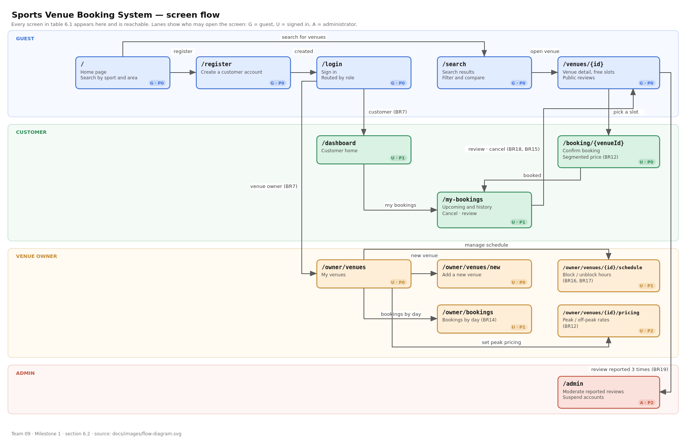

# Requirements - Sports Venue Booking System

**Team 09 · AI66A · Milestone 1 · Sprint 1 (weeks 5-6)**

| | |
|---|---|
| Product Owner | @thunopro |
| Scrum Master (Sprint 1) | @htngochan2802 |
| Repository | https://github.com/SE-FDA-NEU/G9_AI66A_SE |
| Date finalised | 20/09/2026 |

---

## 1. Product vision

Sports Venue Booking System is a time-slot booking platform for amateur sports players
in Hanoi that lets them see which pitch is free at which hour and reserve it in minutes,
instead of messaging several venue owners one by one and waiting for a reply - something
a Facebook page or a phone number cannot solve, because neither of them knows whether
the slot has already been taken.

---

## 2. Personas

### Persona 1 - Minh, the one who organises the football game

**Role:** customer · office worker, 27, Cau Giay district · the person who gathers a
group of 12 players for 7-a-side football every Tuesday and Thursday evening.

Every week Minh messages three or four venue owners he knows to ask whether the
19:00-20:00 slot is still free. Some reply two hours later, some never reply. Twice the
whole group turned up and found other people already playing, because the owner had
forgotten he had taken another booking.

**Goal:** lock in a pitch and a time slot before 17:00 so he can tell the group where
to go after work.

**Blocked by:** there is nowhere that shows which slots are free at the moment he asks;
owners keep their schedule in a paper notebook, so they double-book without noticing.

**In his words:** *"I don't mind paying a bit more. I mind messaging four places and
still not knowing whether we have a pitch tonight."*

**Technical skill:** phone first, orders food and books rides confidently, never opens
a laptop for this. The interface has to work on a small screen.

---

### Persona 2 - Ms Lan, owner of a badminton court cluster

**Role:** venue owner · 41, Thanh Xuan district · owns a cluster of 4 indoor badminton
courts, open 06:00-22:00.

Ms Lan records bookings in a notebook kept at the front desk. At weekends all 4 courts
can be full all day, and the staff on duty has to answer the phone and write at the same
time, so on average 2-3 times a month a slot gets written down twice and a customer has
to be turned away. When a net needs repairing or the lines need repainting, she has to
call every customer who booked and cancel on them.

**Goal:** see the whole schedule of all 4 courts on one screen, and block out maintenance
hours herself without phoning anybody.

**Blocked by:** a paper notebook cannot be searched quickly and cannot be shared with the
next shift; there is no way for customers to see free hours themselves, so the phone
rings constantly.

**In her words:** *"What I fear most is not an empty court. It is taking two customers
for the same hour and having to send one of them home."*

**Technical skill:** uses Zalo and basic Excel. Will not tolerate software that has to be
learned. The schedule screen has to be understandable at a glance, like the notebook she
already uses.

---

### Persona 3 - Trang, a student who plays badminton in a small group

**Role:** customer · third-year student, 21, rents a room near the university · plays
badminton twice a week with three friends, and they split the court fee equally.

Trang picks a venue on price first and quality second. The hours her group is free are
06:00-08:00 in the morning or after 21:00 - exactly the quiet hours that ought to be
cheaper, but owners usually quote one flat rate, so Trang cannot tell whether she is
paying a peak-hour price. She also wants to know whether a court is clean and properly
lit before travelling there, but the photos on the venue's Facebook page are all old.

**Goal:** find a court under 120,000 VND per hour within 3 km, and know the exact price
for the slot she picks before she commits.

**Blocked by:** prices are not published per time slot; there are no genuine reviews from
people who have played there, so she cannot tell which venue is worth the money.

**In her words:** *"There are four of us splitting it. Twenty thousand more per session
costs us one session a month."*

**Technical skill:** confident, compares prices across several apps before deciding,
always reads reviews before booking anything.

---

### Interview note

| Person | Actual role | When | Format |
|---|---|---|---|
| Mr N.V.M. | Organiser of a 7-a-side football group playing at My Dinh | 12/09/2026, 20:30 | Face to face after a game, about 25 minutes |
| Ms D.T.L. | Owner of a 4-court badminton cluster in Thanh Xuan | 14/09/2026, 10:00 | Face to face at the venue's front desk, about 30 minutes |
| Ms P.T.T. | Third-year student, plays badminton in a group of four | 15/09/2026, 19:00 | Phone conversation, about 15 minutes |

The three personas above are built from these three conversations. Names are abbreviated
at the request of the people interviewed. Two details are kept verbatim because they drive
the whole specification: Ms L.'s figure of **2-3 double-bookings per month** leads directly
to BR11, and Mr M.'s need to confirm a pitch **before 17:00** leads to the requirement that
availability is visible in real time rather than waiting for the owner to confirm.

<!-- TODO @thunopro: if the lecturer asks, the team must be able to say who N.V.M.,
     D.T.L. and P.T.T. are. Agree on this before submitting. -->

---

## 3. Scenarios

### Scenario 1 - Minh locks in a pitch for Thursday evening

1. On Wednesday afternoon Minh is at the office and wants to hold a 7-a-side football
   pitch for Thursday evening, from 19:00 to 20:00.
2. He opens the application on his phone and picks football in the Cau Giay area.
3. The system lists the venues in that area with their hourly price and distance.
4. He opens a venue he knows, selects Thursday, and immediately sees that 19:00-20:00 is
   still free while 20:00-21:00 has already been taken.
5. He selects 19:00-20:00 and sees the exact amount he has to pay for that slot.
6. He confirms the reservation and receives a booking code together with the venue address.
7. From that moment the 19:00-20:00 slot on Thursday disappears from the list of free
   hours, and nobody else can take it.
8. On Wednesday evening one of the group drops out. Minh opens his booking and cancels it
   more than a day before the start, gets a full refund, and the slot is released back to
   other customers.

### Scenario 2 - Ms Lan blocks maintenance hours and checks tomorrow's schedule

1. On Monday morning Ms Lan learns that a technician will come to re-tension the net on
   court 2 on Friday afternoon, from 14:00 to 16:00.
2. She opens the schedule for her court cluster on the computer at the front desk and
   selects court 2 and the Friday date.
3. She marks those two afternoon hours as not accepting customers and records the reason
   as re-tensioning the net.
4. The system confirms the block; from that moment customers searching for a court no
   longer see those two hours for court 2.
5. She tries to block 18:00 on the same day as well, but the system refuses and tells her
   that hour already has a customer - she would have to call that customer and agree with
   them first.
6. She leaves 18:00 as it is, because the technician only needs two hours in the afternoon.
7. The next morning, before the shift handover, she opens the list of bookings for that
   day and counts how many customers are coming, at what time, and with which phone number.
8. She prints that list for the staff on duty, instead of copying it out of the notebook.

---

## 4. User stories

A team of five needs at least 12 stories, of which 4-6 are P0.
**Actual: 12 stories, 6 of them P0, 51 points in total.**

Fibonacci scale (1, 2, 3, 5, 8, 13); points are relative complexity, not hours.
Prioritisation reasoning and estimation notes: [`docs/backlog.md`](backlog.md).

| ID | Issue | Story | Priority | Points | Owner |
|----|-------|-------|----------|--------|-------|
| US01 | #14 | Customer registration | P0 | 3 | @thunopro |
| US02 | #15 | User login | P0 | 3 | @thunopro |
| US03 | #16 | Customer searches for venues | P0 | 5 | @peng543 |
| US04 | #17 | Customer views venue details and availability | P0 | 5 | @peng543 |
| US05 | #18 | Customer books a venue | P0 | 8 | @peng543 |
| US06 | #21 | Venue owner adds a new venue | P0 | 5 | @PhunghoaAI |
| US07 | #19 | Customer cancels a booking | P1 | 3 | @PhunghoaAI |
| US08 | #20 | Customer views booking history | P1 | 3 | @PhunghoaAI |
| US09 | #22 | Venue owner manages venue availability schedule | P1 | 5 | @lequangk2006-sys |
| US10 | #23 | Venue owner views list of bookings | P1 | 3 | @lequangk2006-sys |
| US11 | #24 | Venue owner sets peak-hour pricing | P2 | 5 | @htngochan2802 |
| US12 | #25 | Customer leaves a review and rating | P2 | 3 | @htngochan2802 |

The full specification of each story - including every acceptance criterion and the task
breakdown - lives in [`docs/stories/`](stories/), one file per story.

---

### US01 - Customer registration · #14 · P0 · 3 points · `/register`

As **Trang**, I want **to create an account with an email address and a password** so that
**I keep my own booking history and do not have to message a venue owner every time I want
to play**.

**Acceptance criteria**

1. Given the email `hoa.nguyen@gmail.com` does not exist in the system, when I register
   with the password `sanbong2026` (11 characters) and the full name `Nguyen Thi Hoa`,
   then the account is created, I am taken to the login page, and a verification email is
   sent to that address.
2. Given the email `hoa.nguyen@gmail.com` **already** exists, when I register again with
   that same email, then the system shows exactly **"This email is already in use"** and
   does not create a second account (BR1).
3. Given I enter the password `sanbong` (**7 characters**), when I submit, then the system
   shows exactly **"Password must be at least 8 characters"** and keeps everything I
   already typed in the other fields (BR2).
4. Given I enter the phone number `091234567` (**9 digits**), when I submit, then the
   system shows exactly **"Phone number must be 10 digits"**; `0912345678` is accepted
   (BR3).
5. Given my account has not been verified by email, when I try to book a venue, then it is
   rejected with **"Please verify your email before booking"**; the verification link
   expires **24 hours** after it is sent (BR4).

---

### US02 - User login · #15 · P0 · 3 points · `/login`

As a **registered user**, I want **to sign in with my email and password** so that **I
reach my own area and see only my own bookings**.

**Acceptance criteria**

1. Given the account `hoa.nguyen@gmail.com` is verified and its password is `sanbong2026`,
   when I enter both correctly, then I land on my personal page and see the name
   `Nguyen Thi Hoa` in the top right corner.
2. Given I have entered a wrong password **4 times in a row**, when I get it wrong for the
   **5th time**, then the account is locked for **15 minutes** and the system shows exactly
   **"Account temporarily locked. Try again in 15 minutes"** (BR5).
3. Given I enter a wrong password, when the system reports the error, then the message is
   exactly **"Email or password is incorrect"** for **both** the case where the email does
   not exist and the case where it exists but the password is wrong (BR6).
4. Given the account is a **venue owner** account, when the sign-in succeeds, then I land
   in the venue management area, not the customer page (BR7).
5. Given I have been inactive for **30 minutes**, when I open a page that requires signing
   in, then the session has expired and I am returned to the login page with **"Your
   session has expired"** (BR8).

---

### US03 - Customer searches for venues · #16 · P0 · 5 points · `/search`

As **Minh**, I want **to search for venues by sport and by area** so that **I find
somewhere suitable to play without asking owners one by one**.

**Acceptance criteria**

1. Given I am on the home page, when I search for **"Football"** in **"Cau Giay"**, then I
   see a list of football pitches located in Cau Giay, with no other sport and no other
   area mixed in (BR9).
2. Given I search an area that has no venues, when I submit the search, then the system
   shows exactly **"No venues found"** instead of an empty list (BR9).
3. Given I type the word `badminton` into the search field, when I reach the 3rd character,
   then the result list narrows to only the venues with `badminton` in their name or sport.

---

### US04 - Customer views venue details and availability · #17 · P0 · 5 points · `/venues/{id}`

As **Minh**, I want **to see a venue's details and which of its hours are free** so that
**I can decide which slot to book**.

**Acceptance criteria**

1. Given I am looking at a specific venue, when I select the date `20/09/2026`, then I see
   every time slot for exactly that date with the status **free** or **booked** for each
   one - not another date (BR10).
2. Given the venue has 16 slots in a day from 06:00 to 22:00 and 3 of them are already
   booked, when the page finishes loading, then exactly **13 slots** show as free and
   **3 slots** show as booked.
3. Given I open the photo gallery for venue A, when the photos appear, then they belong to
   venue A and not to another venue.

---

### US05 - Customer books a venue · #18 · P0 · 8 points · `/booking/{venueId}`

As **Minh**, I want **to book a venue for a specific time slot** so that **I am certain I
have the time before I tell the group**.

**Acceptance criteria**

1. Given I have selected the free slot `18:00-19:00` on `20/09/2026`, when I confirm the
   booking, then it is confirmed, I receive a booking code, and that slot **no longer
   appears as free** to any other customer (BR11).
2. Given another customer booked `18:00-19:00` while I was still on the confirmation step,
   when I press confirm, then my booking is rejected and the system shows exactly **"This
   time slot is no longer available"** (BR11).
3. Given the venue is fully booked for the whole day I selected, when I open the booking
   page, then the system shows exactly **"This venue is fully booked on 20/09/2026"** and
   suggests the nearest date that still has space.
4. Given the slot I chose is `19:00-21:00`, which crosses the `20:00` pricing boundary,
   when the system calculates the total, then it is **1 hour at the peak rate + 1 hour at
   the standard rate**, displayed as two separate lines and not rounded up (BR12).

---

### US06 - Venue owner adds a new venue · #21 · P0 · 5 points · `/owner/venues/new`

As **Ms Lan**, I want **to add a new venue with its name, address, hourly price and
photos** so that **customers can find and book my venue**.

**Acceptance criteria**

1. Given I am signed in as a venue owner, when I enter the name `San bong Thong Nhat`, the
   address `123 Nguyen Trai, District 5`, the price `250,000` VND per hour, upload 1 photo
   and submit, then the system shows exactly **"Venue added successfully!"** and the venue
   appears in my list at `250,000` VND per hour.
2. Given I enter a price of `0` or `-50,000`, when I submit, then the system refuses and
   shows exactly **"Hourly price must be at least 1,000 VND"** (BR13).
3. Given I leave the venue name empty, when I submit, then the system refuses and shows
   exactly **"Please enter the venue name"**; the name must be **3 to 100 characters**
   (BR13).
4. Given I am signed in as a customer, when I open the add-venue URL directly, then the
   system returns **403** with **"You do not have permission to access this page"** (BR14).

---

### US07 - Customer cancels a booking · #19 · P1 · 3 points · `/my-bookings`

As **Minh**, I want **to cancel an upcoming booking** so that **I am not charged when my
plans change**.

**Acceptance criteria**

1. Given booking `BK-1002` worth `300,000` VND for 18:00-19:00 on 25/09/2026, when I cancel
   it at 15:00 on 24/09/2026 (**27 hours before**), then the booking becomes
   **"Cancelled"**, I am refunded **100% (300,000 VND)**, the system shows exactly
   **"Booking cancelled. You have been refunded 100% (300,000 VND)"**, and the slot is
   released to other customers (BR15).
2. Given booking `BK-1004` worth `400,000` VND starting at 18:00 today, when I cancel it at
   10:00 the same day (**8 hours before**), then I am refunded **50% (200,000 VND)** and
   the system states that exact figure (BR15).
3. Given booking `BK-1003` starting at 17:00 today, when I try to cancel at 16:00 (**1 hour
   before**), then the system refuses and shows exactly **"A booking cannot be cancelled
   less than 2 hours before it starts"** (BR15).
4. Given I am signed in as `userB@gmail.com`, when I send a cancel request for booking
   `BK-1002`, which belongs to another account, then the system returns **403** with
   **"You do not have permission to cancel this booking"** (BR14).

---

### US08 - Customer views booking history · #20 · P1 · 3 points · `/my-bookings`

As **Trang**, I want **to look back over my booking history** so that **I can keep track of
sessions I have played and the ones coming up**.

**Acceptance criteria**

1. Given I have 3 bookings (`BK-1001` on 15/09 completed, `BK-1002` on 25/09 confirmed,
   `BK-1003` on 01/10 pending), when I open my booking history, then the system shows
   exactly **3 rows**, newest first (`BK-1003`, `BK-1002`, `BK-1001`), each row carrying 5
   fields: booking code, venue name, time slot, total price, status.
2. Given I open the detail of booking `BK-1001`, when the page appears, then it shows the
   exact amount paid **"250,000 VND"** and the status **"Completed"**.
3. Given a newly created account that has never booked anything, when I open the history,
   then the system shows exactly **"You have no bookings yet"** with a button back to the
   search page - not an empty table.
4. Given I have 5 bookings (2 confirmed, 2 completed, 1 cancelled), when I filter by status
   **"Cancelled"**, then exactly **1 row** remains.

---

### US09 - Venue owner manages venue availability schedule · #22 · P1 · 5 points · `/owner/venues/{id}/schedule`

As **Ms Lan**, I want **to block and unblock time slots on my own schedule** so that **I
keep maintenance hours free and customers cannot book while the court is unusable**.

**Acceptance criteria**

1. Given the slot **18:00-19:00 on 25/09/2026** on court 2 is free, when I block it with
   the reason `Pitch maintenance`, then the slot disappears from the customer's list of
   free hours, and on my schedule it shows a grey background with **"Blocked - Pitch
   maintenance"** (BR16).
2. Given that slot is blocked, when I unblock it, then within **5 seconds** the slot
   reappears in the list of free hours (BR16).
3. Given the slot **19:00-20:00 on 25/09/2026** already holds booking `BK-000148`, when I
   try to block it, then the system refuses with exactly **"Cannot block: this slot already
   has 1 booking (BK-000148). Cancel the booking first."** and no booking is silently
   deleted (BR17).
4. Given I block in bulk from **01/10 to 05/10/2026, slot 06:00-08:00**, and on 03/10 that
   slot already has a booking, when I confirm, then **4 slots** are blocked and the system
   reports exactly **"4 slots blocked. 1 slot skipped because it already has a booking:
   03/10/2026 06:00-08:00"** (BR17).

---

### US10 - Venue owner views list of bookings · #23 · P1 · 3 points · `/owner/bookings`

As **Ms Lan**, I want **to see every booking across the venues I manage, day by day** so
that **I know how many customers are coming and at what time, and can prepare**.

**Acceptance criteria**

1. Given today is **20/09/2026** and my venues hold **7 bookings**, when I open the list,
   then the page defaults to 20/09/2026 with exactly **7 rows** sorted by start time
   ascending, and the heading reads exactly **"7 bookings on 20/09/2026"**.
2. Given I select **22/09/2026**, when the list changes, then it finishes loading **within
   2 seconds** and shows exactly that date's bookings.
3. Given any row in the list, when I look at it, then it carries **6 columns**: booking code
   (`BK-000148`), venue name (`Court 2`), time slot (`19:00-20:00`), customer name, phone
   number (`0912345678`), status.
4. Given **28/09/2026** has no bookings, when I select that date, then the system shows
   exactly **"No bookings on 28/09/2026"**.
5. Given `BK-000901` belongs to another owner's venue, when I open that booking's URL
   directly, then the system returns **403** with **"You do not have permission to view this
   booking"** (BR14).

---

### US11 - Venue owner sets peak-hour pricing · #24 · P2 · 5 points · `/owner/venues/{id}/pricing`

As **Ms Lan**, I want **to charge different rates for peak and off-peak hours** so that **I
match my revenue to actual demand through the day**.

**Acceptance criteria**

1. Given the venue's default rate is `150,000` VND per hour and I create a peak rule of
   `250,000` VND per hour for **17:00-20:00 Monday to Friday**, when a customer books
   18:00-19:00 on a Tuesday, then the price shown is **250,000 VND** (BR12).
2. Given that rule, when a customer books **19:00-21:00** (crossing the 20:00 boundary),
   then the total is split per segment: **1 h × 250,000 + 1 h × 150,000 = 400,000 VND**,
   displayed as two lines and **not rounded up to the peak rate** (BR12).
3. Given a rule for 17:00-20:00 Monday to Friday already exists on court 2, when I create a
   second rule for 18:00-21:00 that also covers Tuesday on the same court, then the system
   refuses because the two rules overlap (BR12).
4. Given a customer has a confirmed booking at `250,000` VND, when I later change the rule
   to `300,000` VND, then the confirmed booking **stays at 250,000 VND** (BR12).

---

### US12 - Customer leaves a review and rating · #25 · P2 · 3 points · `/my-bookings`, `/venues/{id}`

As **Trang**, I want **to rate and review a venue after playing there** so that **other
people know which venue is worth the money**.

**Acceptance criteria**

1. Given my booking `BK-1001` is **completed** and its end time has passed, when I give it
   **4 stars** with a 120-character comment, then the review is published and the venue's
   average rating is recalculated (BR18).
2. Given I have already reviewed booking `BK-1001`, when I try to review the same booking
   again, then the system refuses - **one review per booking** (BR18).
3. Given my booking is **cancelled** or **unpaid**, when I open it, then no review button
   appears (BR18).
4. Given I write a comment of **1,001 characters**, when I submit, then the system refuses
   because the limit is **1,000 characters**; the star rating is required and is an integer
   from **1 to 5** (BR18).
5. Given a review receives **3 valid abuse reports**, when the third report is submitted,
   then the review is automatically hidden pending administrator review (BR19).

---

## 5. Business rules

Each rule is a constraint the system enforces, not a feature. The numbering below is the
**single project-wide sequence** - the files in `docs/stories/` number their rules locally
within each file, and this is the authoritative list that issues and tests cite.

| ID | Rule | Worked example (real numbers) |
|----|------|-------------------------------|
| **BR1** | One email address maps to exactly one account | `hoa.nguyen@gmail.com` registers at 09:00 on 19/09 and succeeds. At 14:00 the same day the same email registers again → rejected, the system still holds exactly 1 account. |
| **BR2** | A password is at least 8 characters and contains at least one letter and one digit | `sanbong` (7 characters) → rejected. `12345678` (8 characters, no letter) → rejected. `sanbong1` (8 characters, both) → accepted. |
| **BR3** | A phone number is exactly 10 digits and starts with 0 | `0912345678` → accepted. `091234567` (9 digits) → rejected. `1912345678` (does not start with 0) → rejected. |
| **BR4** | An account with an unverified email cannot book; the verification link expires after 24 hours | Registered at 10:00 on 19/09 → the link expires at 10:00 on 20/09. Clicking it at 11:00 on 20/09 → expired, a new one must be requested. |
| **BR5** | Five consecutive wrong passwords lock the account for 15 minutes; a successful sign-in resets the counter to 0 | Wrong at 20:00, 20:01, 20:02, 20:03, 20:04 → locked until 20:19. At 20:10 even the correct password is refused. At 20:20 the correct password succeeds and the counter returns to 0. |
| **BR6** | A failed sign-in message must not reveal whether the email exists | Email does not exist → "Email or password is incorrect". Email exists but the password is wrong → **the same sentence**, not "Wrong password". |
| **BR7** | Where a user lands after signing in depends on their role | Customer → the customer page. Venue owner → the venue management area. Administrator → the admin area. |
| **BR8** | A session expires after 30 minutes of inactivity | Signed in at 19:00, last action 19:10 → the session expires at 19:40. Opening a page at 19:45 → returned to the login page. |
| **BR9** | Search results must match the sport **and** the area at the same time; no match returns an explicit empty-state message | "Football" + "Cau Giay" → only football pitches in Cau Giay, not badminton courts in Cau Giay. "Football" + "Ba Vi" (0 venues) → shows "No venues found". |
| **BR10** | Availability is always shown for exactly the date the customer selected | A venue open 06:00-22:00 has 16 slots a day. On 20/09 three are booked → 13 free + 3 booked. Switching to 21/09 recalculates for 21/09. |
| **BR11** | A venue time slot holds exactly one active booking; the system re-checks availability immediately before confirming | Customer A confirms 18:00-19:00 on 20/09 at 14:00:00. Customer B presses confirm for the same slot at 14:00:03 → rejected with "This time slot is no longer available". Result: 1 booking, not 2. |
| **BR12** | Prices are per hour in VND; slots are half-open `[start, end)`; a booking crossing a boundary is split per segment and never rounded up; pricing rules must not overlap on the same venue and weekday; a confirmed booking keeps its original price | Standard 150,000, peak 250,000 for 17:00-20:00. Booking 19:00-21:00 → 1×250,000 + 1×150,000 = **400,000 VND**, not 500,000. A rule for 17:00-20:00 Tuesday exists; adding 18:00-21:00 Tuesday → rejected. |
| **BR13** | The hourly price is an integer from 1,000 to 100,000,000 VND; the venue name is required and 3 to 100 characters long | Price `0` or `-50,000` → rejected. Price `250,000` → accepted. Name `Sa` (2 characters) → rejected. Name `San bong Thong Nhat` (19 characters) → accepted. |
| **BR14** | A user may only view and act on data that belongs to them: customers on their own bookings, owners on their own venues; a violation returns 403 | `userB` opens `BK-1002` belonging to `userA` → 403. Owner X opens `BK-000901` belonging to owner Y → 403. A `customer` account opens the add-venue page → 403. |
| **BR15** | Cancellation has three tiers based on the distance to the start time: **≥ 24 h → 100% refund**, **2 h to under 24 h → 50% refund**, **< 2 h → cancellation refused** | A 300,000 VND booking plays at 18:00 on 25/09. Cancelled at 15:00 on 24/09 (27 h before) → 300,000 refunded. A 400,000 VND booking plays at 18:00, cancelled at 10:00 the same day (8 h before) → 200,000 refunded. A booking playing at 17:00, cancelled at 16:00 (1 h before) → refused. |
| **BR16** | A slot blocked by the owner does not appear in search and cannot be booked; unblocking takes effect within 5 seconds | Blocked 18:00-19:00 on 25/09 at 09:00 → a customer arriving at 09:01 does not see it. Unblocked at 10:00:00 → a customer loading the page at 10:00:05 sees it again. |
| **BR17** | A slot that holds an uncancelled booking cannot be blocked; a bulk block skips those slots and reports how many | Slot 19:00-20:00 on 25/09 holds `BK-000148` → blocking is refused. Bulk block 01/10-05/10 for 06:00-08:00 where 03/10 is booked → 4 slots blocked, reported as "1 slot skipped: 03/10/2026 06:00-08:00". |
| **BR18** | Only a completed booking whose end time has passed can be reviewed; exactly one review per booking; the rating is an integer 1-5 and the comment is at most 1,000 characters | Booking `BK-1001` completes at 19:00 on 15/09 → reviewable from 19:00 onwards. A second review for `BK-1001` → refused. A 1,001-character comment → refused. A `cancelled` booking → no review button. |
| **BR19** | A review that receives 3 valid abuse reports is automatically hidden pending administrator review | The review on `BK-1001` is reported at 10:00, 11:00 and 15:00 on 16/09 → from 15:00 it is no longer publicly visible and enters the moderation queue. |

---

## 6. Screens and flow

### 6.1 Screen table

| Route | Purpose | Access | Priority |
|-------|---------|--------|----------|
| `/` | Home page: search by sport and area, entry to sign in and register | G | P0 |
| `/register` | Create a customer account | G | P0 |
| `/login` | Sign in, route by role | G | P0 |
| `/search` | Search results, filter by sport, area, time slot and price | G | P0 |
| `/venues/{id}` | Venue detail: photos, price, facilities, free-slot grid, reviews | G | P0 |
| `/booking/{venueId}` | Confirm a booking: pick a slot, see the segmented price, confirm | U | P0 |
| `/dashboard` | The customer's page after signing in | U | P1 |
| `/my-bookings` | My bookings: upcoming, history, cancel, review after playing | U | P1 |
| `/owner/venues` | The owner's list of venues | U | P0 |
| `/owner/venues/new` | Add a new venue | U | P0 |
| `/owner/venues/{id}/schedule` | Venue schedule: block and unblock hours for maintenance | U | P1 |
| `/owner/venues/{id}/pricing` | Configure peak and off-peak pricing | U | P2 |
| `/owner/bookings` | Day-by-day list of bookings across the owner's venues | U | P1 |
| `/admin` | Moderate reported reviews, suspend offending accounts | A | P2 |

**Access:** G = guest, not signed in · U = signed in · A = administrator

Full traceability (screen → feature → issue → PR → status):
[`docs/traceability.md`](traceability.md).

### 6.2 Flow diagram



*Figure 1 - Screen flow diagram. Vector version:
[`docs/images/flow-diagram.svg`](images/flow-diagram.svg). Blue = guest screens (G),
green = signed-in screens (U), red = administrator (A).*

The same diagram as text, so it is readable even if the image does not render:

```
                       ┌─────────────────┐
                       │        /        │  guest, not signed in
                       │   (home page)   │
                       └──┬───────────┬──┘
                 search   │           │  register
                          ▼           ▼
                   ┌───────────┐  ┌─────────────┐
          ┌───────▶│  /search  │  │  /register  │
          │        └─────┬─────┘  └──────┬──────┘
          │   pick a     │               │ created
          │   venue      ▼               ▼
          │       ┌───────────────┐  ┌──────────┐
          │       │ /venues/{id}  │  │  /login  │◀── session expired (BR8)
   search │       │  detail +     │  └────┬─────┘
   again  │       │  free slots   │       │ signed in,
          │       └───────┬───────┘       │ routed by role (BR7)
          │               │ pick a slot   │
          │               ▼               ├─── CUSTOMER ───┐
          │       ┌────────────────────┐  │                │
          └───────┤ /booking/{venueId} │◀─┘                │  OWNER
   fully booked   │  confirm + price   │                   ▼
   (BR11)         └─────────┬──────────┘          ┌─────────────────┐
                            │ booked              │  /owner/venues  │
                            ▼                     └──┬────┬────┬────┘
                  ┌──────────────────┐  add venue    │    │    │
                  │    /dashboard    │◀──────────────┘    │    │
                  │    (customer)    │       │            │    │
                  └────────┬─────────┘       ▼            │    │
                           │       ┌─────────────────────┐│    │
                           ▼       │  /owner/venues/new  ││    │
                  ┌──────────────┐ └─────────────────────┘│    │
            ┌────▶│ /my-bookings │                        │    │ bookings
            │     │  upcoming ·  │   block maintenance    │    │ by day
   book     │     │  history ·   │            ┌───────────┘    │
   again    │     │  cancel ·    │            ▼                ▼
   after    │     │  review      │  ┌──────────────────────────────────┐
   playing  │     └───┬──────┬───┘  │  /owner/venues/{id}/schedule     │
            │         │      │      │   block / unblock (BR16, BR17)   │
            └─────────┘      │      └──────────────────────────────────┘
       cancel (BR15)         │                       │
       → slot released       │ review                │   ┌────────────────────┐
                             │ (BR18)                └──▶│  /owner/bookings   │
                             ▼                           │  day-by-day list   │
                    ┌──────────────────┐                 │  (BR14)            │
                    │   /venues/{id}   │                 └────────────────────┘
                    │  review shown    │                            │
                    │  publicly        │     set peak pricing       │
                    └────────┬─────────┘                 ┌──────────┘
                             │ reported                  ▼
                             │ 3 times   ┌────────────────────────────────┐
                             │ (BR19)    │  /owner/venues/{id}/pricing    │
                             ▼           └────────────────────────────────┘
                    ┌──────────────────┐
                    │      /admin      │  administrator
                    │  moderate        │
                    │  reported        │
                    │  reviews         │
                    └──────────────────┘
```

Every screen in table 6.1 appears in the diagram and is reachable: guests enter at `/`;
customers follow the left branch; owners follow the right branch after the role split at
`/login` per BR7; `/admin` is reached from the review-reporting flow.

---

## Appendix - where this document comes from

| Content | Source |
|---|---|
| Detailed specification of each story, with task breakdown | [`docs/stories/`](stories/) - one file per story, one Pull Request per file |
| Priority, story points and prioritisation reasoning | [`docs/backlog.md`](backlog.md) |
| Screen → issue → PR traceability | [`docs/traceability.md`](traceability.md) |
| Committed / completed / velocity, review and retrospective | [`docs/sprint-log.md`](sprint-log.md) |
| Definition of Done | [`docs/definition-of-done.md`](definition-of-done.md) |
| The development process the team chose and why | [`docs/process.md`](process.md) |
